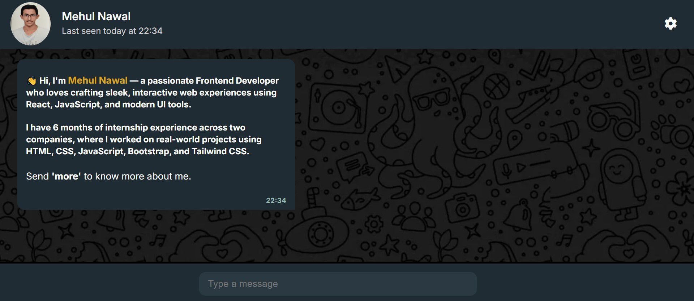

# 💬 React Chat Interface UI

### 👨‍💻 About Me

Hi, I'm **Mehul Nawal**, a passionate frontend developer focused on building modern, interactive web applications using **React**, **JavaScript**, and animation libraries.  
I love turning ideas into real projects that are clean, user-friendly, and responsive.

- 🔗 [LinkedIn](https://www.linkedin.com/in/mehul-nawal-2b1492244/)
- 💻 [GitHub](https://github.com/mehulnawal)

---

## 🚀 Features

- 🎨 **Custom Chat Backgrounds** – Choose from solid colors or beautiful image backgrounds.
- 💬 **Dynamic Message Handling** – Sends user input and displays different chatbot responses based on keywords.
- 🔊 **Sound Feedback** – Play a notification tone on each message sent.
- 🗑️ **Delete Confirmation** – Secure chat clearing with a confirmation prompt.
- ⚙️ **Settings Panel** – Toggle chat features from a clean, modern settings menu.
- ⌨️ **Keyboard Shortcuts** – Press `Enter` to send messages quickly.
- 🎯 **Fully Responsive** – Works seamlessly on all devices.

---

## 📸 Preview


---

## 🛠️ Tech Stack

- **React** (with Hooks: `useState`, `useEffect`, `useRef`)
- **HTML5 & CSS3**
- **Font Awesome** (for icons)
- **Custom Audio Integration**
- **No backend** – Pure frontend experience

---

## 📁 Folder Structure
📦 chat-interface/
├── 📁 assets/ # Profile images, backgrounds, audio
├── 📄 index.css # Styling
├── 📄 App.jsx # Main logic
├── 📄 chatComponent.jsx # All reply UI components
├── 📄 README.md # You're reading it!

---

## ⚙️ How to Run Locally

```bash
# 1. Clone this repository
git clone https://github.com/your-username/chat-interface.git

# 2. Navigate into the project directory
cd chat-interface

# 3. Install dependencies
npm install

# 4. Run the development server
npm run dev
